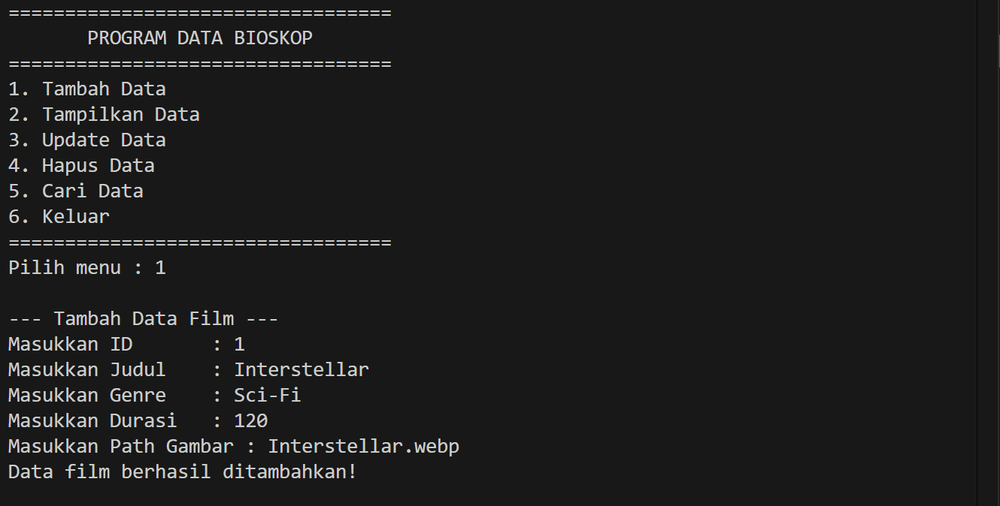
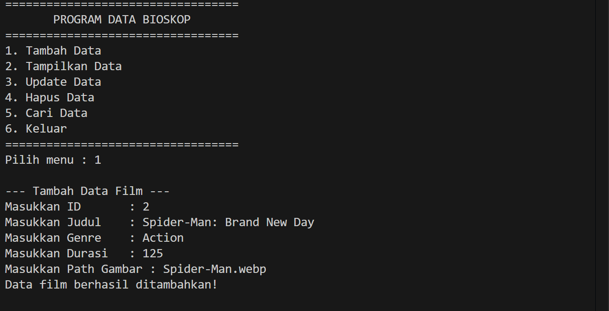
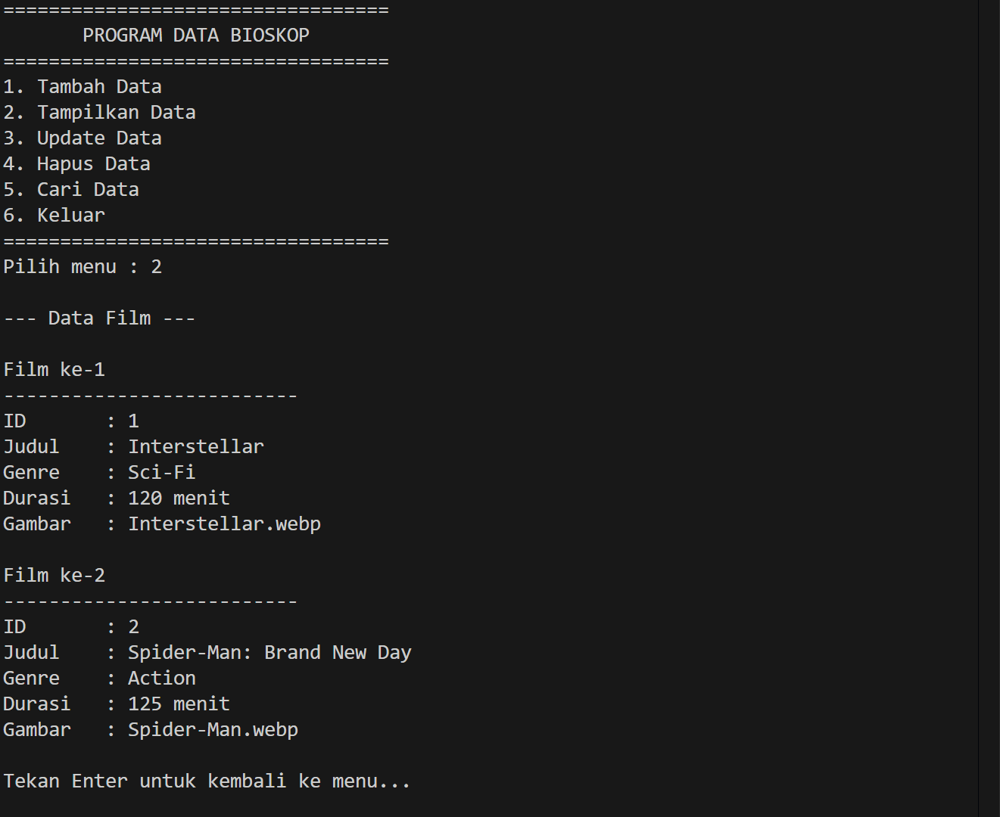
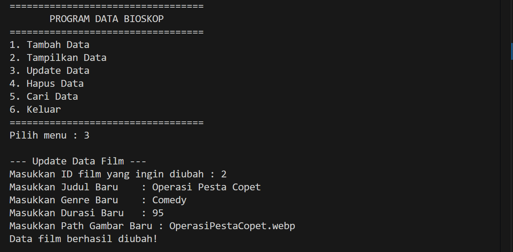
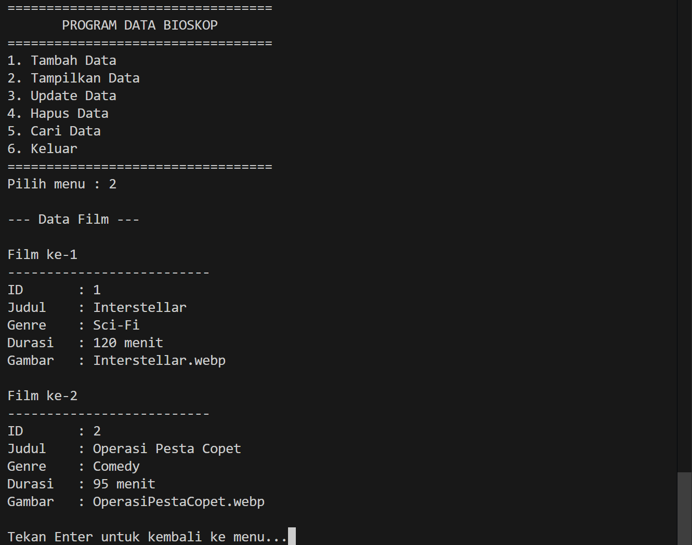
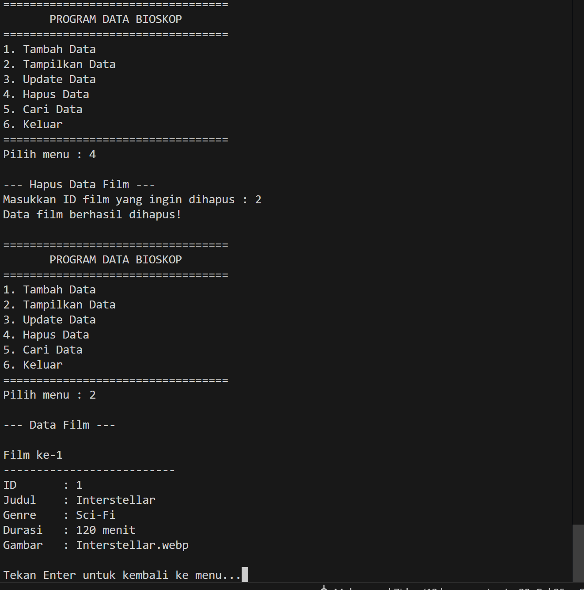
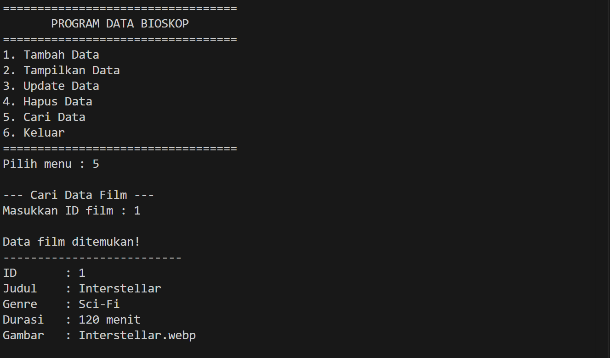
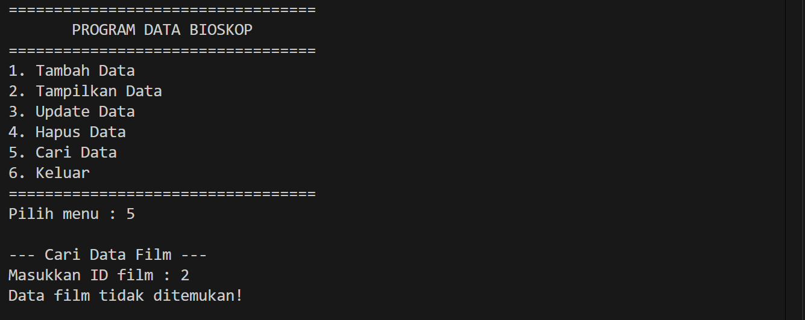
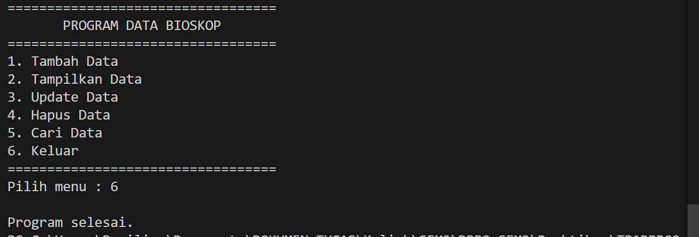
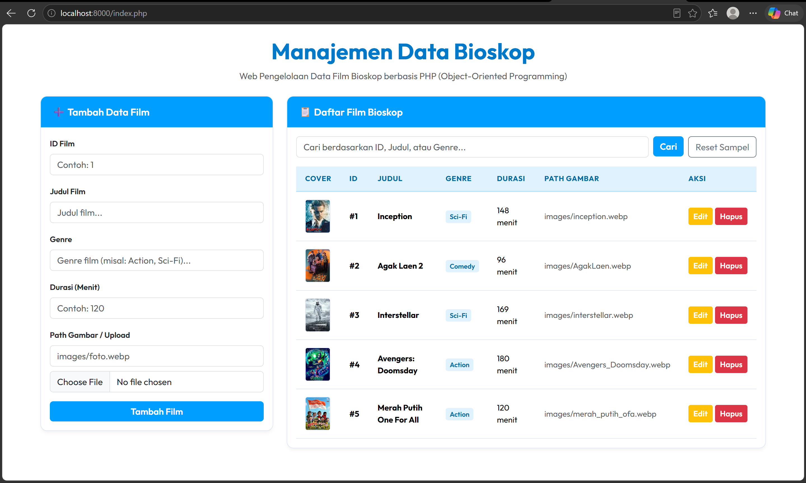

# Tugas Praktikum 1 DPBO 2526 (TP1DPBO2526C2)
Sistem Manajemen Data Bioskop dalam 4 Bahasa Pemrograman (C++, Java, Python, PHP)

---

## Janji

> Saya Muhammad Zidan Mirza Fedrieka dengan NIM 2507692 mengerjakan Tugas Praktikum 1 dalam mata kuliah Desain Pemrograman Berorientasi Objek untuk keberkahan-Nya maka saya tidak melakukan kecurangan seperti yang telah dispesifikasikan. Aamiin.

---

## Penjelasan Desain dan Kode (Flow Kode)

### 1. Desain Class & Enkapsulasi (Encapsulation)
Program ini menerapkan konsep **Object-Oriented Programming (OOP)** dengan pembungkusan data (*Encapsulation*) pada kelas `Film`.

- **Atribut (Private)**:
  - `id` (integer) : Identitas unik untuk setiap film.
  - `judul` (string) : Judul film bioskop.
  - `genre` (string) : Genre dari film (misal: Action, Sci-Fi, Comedy).
  - `durasi` (integer) : Durasi pemutaran film (dalam menit).
  - `gambar` (string) : Path lokasi file gambar lokal (misal: `images/inception.webp`).

- **Method (Public)**:
  - **Constructor** : Menginisialisasi objek film baru dengan data lengkap.
  - **Getter & Setter** : Mengakses dan mengubah nilai atribut secara terenkapsulasi (`getId()`, `setId()`, `getJudul()`, `setJudul()`, `getGenre()`, `setGenre()`, `getDurasi()`, `setDurasi()`, `getGambar()`, `setGambar()`).
  - **tampilkanData()** : Memformat dan mencetak detail informasi objek film.

---

### 2. Struktur File 
```
C:.
│   README.md
│
├───CPP
│       Film.cpp
│       main.cpp
│
├───Dokumentasi
├───Java
│       Film.java
│       Main.java
│
├───PHP
│   │   Film.php
│   │   index.php
│   │
│   └───images
│
└───Python
        Film.py
        main.py
```
---

### 3. Alur Eksekusi Program (Flow Code)
Program mengelola daftar objek `Film` menggunakan struktur data *Array of Objects*, `ArrayList`, `list`, atau `$_SESSION` di PHP:

1. **Inisialisasi Data**: Program menyiapkan wadah penampung daftar film (disertai sampel awal pada versi PHP Web).
2. **Menu Utama & Navigasi**:
   - **1. Tambah Data (Create)**: Meminta input ID, Judul, Genre, Durasi, dan Path Gambar. Memeriksa keberadaan ID dan validitas input sebelum menambah objek `Film` baru.
   - **2. Tampilkan Data (Read)**: Menelusuri seluruh daftar film dan memanggil method `tampilkanData()` / menampilkan tabel web.
   - **3. Update Data (Update)**: Mencari film berdasarkan ID, lalu meminta input data baru dan memperbarui atribut objek dengan *setter*.
   - **4. Hapus Data (Delete)**: Mencari film berdasarkan ID lalu menghapusnya dari daftar.
   - **5. Cari Data (Search)**: Mencari film berdasarkan ID (atau filter keyword pada PHP) dan menampilkan detail hasilnya.
   - **6. Keluar (Exit)**: Menutup dan mengakhiri eksekusi program.

---

## Cara Menjalankan Program

### 1. Clone Repository & Persiapan

Lakukan kloning repository ini terlebih dahulu dan masuk ke direktori proyek:

```bash
# Clone repository
git clone https://github.com/Zidane-m/TP1DPBO2526C2.git

# Masuk ke direktori proyek
cd TP1DPBO2526C2
```

---

### 2. C++
```bash
# Masuk ke direktori CPP
cd CPP

# Kompilasi kode program C++
g++ main.cpp -o main

# Eksekusi program
# Pada Windows (CMD / PowerShell):
.\main.exe
# Pada Linux / macOS:
./main
```

### 3. Java
```bash
# Masuk ke direktori Java
cd Java

# Kompilasi kode program Java
javac Film.java Main.java

# Eksekusi program
java Main
```

### 4. Python
```bash
# Masuk ke direktori Python
cd Python

# Eksekusi program
py main.py
# atau
python main.py
```

### 5. PHP (Web Interface)
```bash
# Masuk ke direktori PHP
cd PHP

# Jalankan server lokal PHP
php -S localhost:8000

# Buka browser dan akses alamat berikut:
# http://localhost:8000/index.php
```

---

## Penjelasan Error Handling

Program ini dilengkapi dengan penanganan kesalahan (*Error Handling*) menyeluruh pada ke-4 bahasa pemrograman:

1. **Validasi Unik ID (Duplicate ID Prevention)**:
   - Sebelum menambah data baru, program menelusuri seluruh daftar untuk memastikan ID belum pernah digunakan (`"ID sudah digunakan!"`).

2. **Validasi Tipe Data Input (Type Mismatch Handling)**:
   - **Java**: Menggunakan `scanner.hasNextInt()` sebelum membaca nilai integer. Jika pengguna memasukkan huruf, token salah dibersihkan menggunakan `scanner.next()` sehingga mencegah `InputMismatchException` atau *infinite loop*.
   - **Python**: Menggunakan blok `try-except ValueError` saat mengonversi input string ke integer (`int(input())`).
   - **C++**: Menggunakan `cin.ignore()` dan penanganan stream buffer input untuk mencegah loncatan baris pada `getline()`.
   - **PHP**: Casting tipe data `(int)` pada input POST/GET.

3. **Validasi Durasi Positif (`durasi > 0`)**:
   - Menolak input durasi bernilai nol atau negatif dengan pesan `"Durasi harus lebih dari 0!"`.

4. **Validasi Input Kosong (Empty String Validation)**:
   - Memastikan `judul`, `genre`, dan `gambar` tidak boleh berupa string kosong atau hanya spasi (`trim()` di Java/PHP, `.strip()` di Python).

5. **Handling Data Tidak Ditemukan (Search & Update/Delete Safety)**:
   - Menggunakan penanda posisi (`posisi = -1`). Jika ID tidak ditemukan, program menanganinya secara aman tanpa error *index out of bounds* (`"Data film tidak ditemukan!"`).

6. **Handling Kapasitas Maksimum Array (C++)**:
   - Pada C++, array statis berkapasitas 100 elemen diperiksa (`jumlahFilm >= 100`) sebelum menambah data baru (`"Data film sudah penuh!"`).

7. **Handling File & Session (PHP)**:
   - **Upload File**: Pengecekan folder `images/` dan validasi status upload (`UPLOAD_ERR_OK`).
   - **Session Recovery**: Menangani `__PHP_Incomplete_Class` serta fallback konversi path `.webp` jika file gambar di disk diubah.

---

## Dokumentasi Program (Hasil Output)

Berikut adalah dokumentasi hasil eksekusi program. Karena program berbasis CLI (**C++**, **Java**, dan **Python**) memiliki alur antarmuka dan keluaran menu yang sama, dokumentasi CLI disajikan secara berurutan mulai dari menu 1 hingga 6:

### Program CLI (C++ / Java / Python)

#### 1. Pilihan 1: Tambah Data Film (Create)



---

#### 2. Pilihan 2: Tampilkan Data Film (Read)


---

#### 3. Pilihan 3: Update Data Film (Update)



---

#### 4. Pilihan 4: Hapus Data Film (Delete)


---

#### 5. Pilihan 5: Cari Data Film (Search)



---

#### 6. Pilihan 6: Keluar Program (Exit)


---

### Program Web Interface (PHP)


